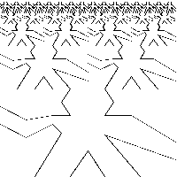

## Exercise 2.44

Full script available in `2-44.scm` so this ran be reproduced in _DrRacket *_.

### Solution

```
(define (up-split painter n)
  (if (= n 0)
      painter
      (let ((smaller (up-split painter (- n 1))))
        (below painter (beside smaller smaller)))))
```

### Tests

```
(paint (up-split wave 4))
```



```
(paint (corner-split wave 4))
```


_* Images saved from running script in DrRacket interpreter and white background added using GIMP._