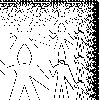
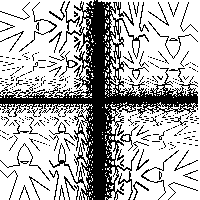

## Exercise 2.52

Full script available as `resources/2-52.scm` so this ran be reproduced in _DrRacket *_.

### Part A - Wave with a Smile

```
(define wave-segments
  (list
    (make-segment (make-vect 0.20 0.00) (make-vect 0.35 0.50))
    (make-segment (make-vect 0.35 0.50) (make-vect 0.30 0.60))
    (make-segment (make-vect 0.30 0.60) (make-vect 0.15 0.45))
    (make-segment (make-vect 0.15 0.45) (make-vect 0.00 0.60))
    (make-segment (make-vect 0.00 0.80) (make-vect 0.15 0.65))
    (make-segment (make-vect 0.15 0.65) (make-vect 0.30 0.70))
    (make-segment (make-vect 0.30 0.70) (make-vect 0.40 0.70))
    (make-segment (make-vect 0.40 0.70) (make-vect 0.35 0.85))
    (make-segment (make-vect 0.35 0.85) (make-vect 0.40 1.00))
    (make-segment (make-vect 0.60 1.00) (make-vect 0.65 0.85))
    (make-segment (make-vect 0.65 0.85) (make-vect 0.60 0.70))
    (make-segment (make-vect 0.60 0.70) (make-vect 0.75 0.70))
    (make-segment (make-vect 0.75 0.70) (make-vect 1.00 0.40))
    (make-segment (make-vect 1.00 0.20) (make-vect 0.60 0.48))
    (make-segment (make-vect 0.60 0.48) (make-vect 0.80 0.00))
    (make-segment (make-vect 0.40 0.00) (make-vect 0.50 0.30))
    (make-segment (make-vect 0.50 0.30) (make-vect 0.60 0.00))))

(define smile-segments
  (list
    (make-segment (make-vect 0.42 0.78) (make-vect 0.47 0.73))
    (make-segment (make-vect 0.47 0.73) (make-vect 0.53 0.73))
    (make-segment (make-vect 0.53 0.73) (make-vect 0.58 0.78))
    (make-segment (make-vect 0.42 0.78) (make-vect 0.58 0.78))
    ))

(define wave-with-smile
  (segments->painter 
    (append wave-segments smile-segments)))

(paint wave-with-smile)
```


### Part B - Modify `corner-split`

```

(define (corner-split painter n)
  (if (= n 0)
      painter
      (let ((up (up-split painter (- n 1)))
            (right (right-split painter (- n 1)))
            (corner (corner-split painter (- n 1))))
        (beside (below painter up)
                (below right corner)))))

(paint (corner-split wave-with-smile 6))
```



### Part C - Modify Square-Limit

```
(define (square-limit painter n)
  (let ((combine4 (square-of-four rotate270 rotate180 identity rotate90)))
    (combine4 (corner-split painter n))))

(paint (square-limit wave-with-smile 6))
```



_* Images saved from running script in DrRacket interpreter and white background added using GIMP._