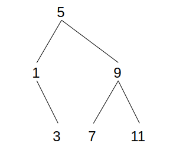

## Exercise 2.64

### Part A - Explanation of `partial-tree`

1. Firstly, if `n` is equal to `0`, return a list whose `car` is the empty set `'()` and whose `cdr` is all elements `elts`.
2. Otherwise, let `left-size` be the quotient of $n-1$ divided by $2$, and the `left-tree`, or left branch of this tree, will be the first elements of `elts` up to the number `left-size`. We recursively call `partial-tree` to work out this subtree, and return the remaining elements of `elts`.
3. This next remaining element is reserved for the top node of this tree, called `this-entry`.
4. The `right-tree`, or right branch of this tree, will be the next elements up to $n$ minus `left-size-1`, which should account for all $n$ elements. We again recursively call `partial-tree` to work out the right branch's subtree.
5. Finally call `make-tree` using the computed current node `this-entry`, the left recursive branch `left-tree` and the right recursive branch `right-tree` and any `remaining-elts` (note this is for recursive use only as there will be none remaining if length of `elts` is equal to `n` as called by `list->tree`).

```
(list->tree (list 1 3 5 7 9 11 13))
;Value: (5 (1 () (3 () ())) (9 (7 () ()) (11 () ())))
```

This tree value is easier to visualise with some pretty printing:

```
(5 (1 () 
      (3 () ())) 
   (9 (7 () ()) 
      (11 () ())))
```



*Tree produced by `list->tree` for list `(1 3 5 7 9 11)`*

### Part B - Order of Growth of `list->tree`

`list->tree` must visit all $n$ elements in a tree, but by reducing the length of elements by half on each level of tree, avoids costly list traversal, `cons`ing the result of recursive trees.

The cost is $O(1)$ for each element $n$ of the tree, so the worst-case steps required overall is $O(n)$.