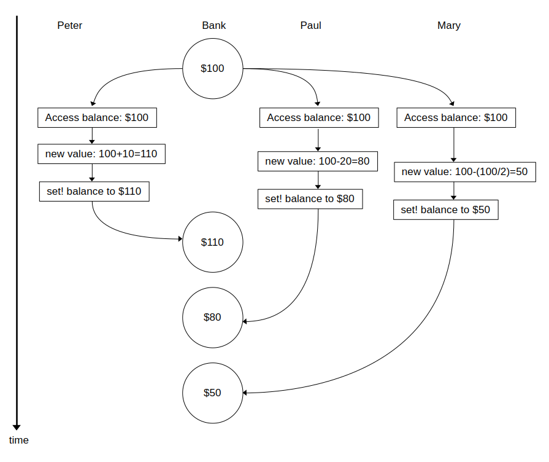

## Exercise 3.38

### Part A

All possible values of `balance` can be derived from each possible sequential order of the three processes.

1. Peter, Paul, Mary 
   - $100 > $110 > $90 > $45 
2. Peter, Mary, Paul
   - $100 > $110 > $55 > $35
3. Paul, Peter, Mary
   - $100 > $80 > $90 > $45
4. Paul, Mary, Peter
   - $100 > $80 > $40 > $50
5. Mary, Peter, Paul
   - $100 > $50 > $60 > $40
6. Mary, Paul, Peter
   - $100 > $50 > $30 > $40

So the possible final values of `balance` are: $35, $40, $45, $50.

### Part B

Below is one possible example of how interleaving the three concurrent events would lead to an erroneous final balance:

Note that when we calculated the possible values of `balance` when the concurrent events are forced to run sequentially, $50 was a valid value (in the order Paul, Mary, Peter). This is due to the nondeterministic nature of the computation. 

However in the above interleaved example, all the account holders access the balance of $100 concurrently. The order of `set!` commands executed is Peter, Paul then Mary. Mary sets the balance from $100 to $50 regardless of what Peter and Paul set it to.

So in part A, we set `balance` to $50 due to a correct interpretation of the nondeterministic computation. In part B, we set `balance` to $50 due to a failure in correctly isolating banking transactions.