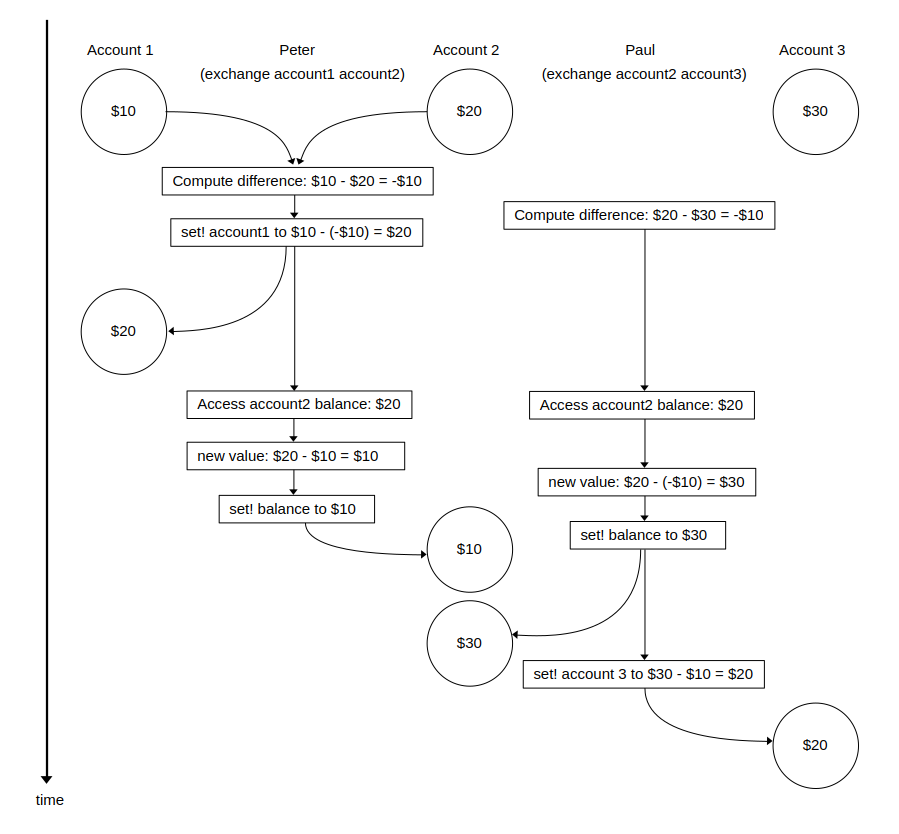

## Exercise 3.43

### Part A - Sequential exchanges

If there are three accounts with balances $10, $20, and $30, then after $n$ concurrent exchanges, so long as each exchange is forced to run sequentially, then the balances will still be $10, $20, and $30 in some order.

Consider that after one exchange, either $10 swaps with $20, or $20 swaps with $30, or $30 swaps with $10, but the balances remain the same (in some order). This is true after each exchange and after $n$ exchanges.

### Part B - Timing diagram for first version of `exchange`

The above diagram demonstrates one possible example where the first version of the `exchange` program is run twice concurrently across the three accounts. The two `withdraw` operations in each exchange happen consecutively, followed by the two `deposit` operations. This results in all accounts having a balance of $20.

### Part C - Sum of balances preserved in first version of `exchange`

In the first version of the `exchange` program, since the `withdraw`, and `deposit` operations are serialised, regardless of what value we compute `difference` to be, we know that whatever value is subtracted from `account1` must be added to `account2`. Therefore the sum of the balances is always the same after one exchange, and always the same after $n$ exchanges.

In the example scenario I gave in Part B, the second computed `difference` was wrong because it was interleaved with the first exchange, before the balance of `account2` had been set by this first exchange. This means we ended up with the wrong account balances. However, even if we use the wrong `difference`, the sum of the balances remains the same.

### Part D - Timing diagram for individual accounts without serialization

In the above diagram, I have demonstrated how the sum of the balances is not preserved if the individual account transactions are not serialized and are able to be interleaved. The resulting sum of the balances is $70, which is more than the $60 we started with!

Like in my first example in Part B, the `exchange` program is run twice concurrently across the three accounts. However this time, while Peter's exchange is depositing into `account2`, it is interleaved with Paul's exchange withdrawing into `account2`. Both operations access the balance when it is $20, but after that, Peter's deposit `set!` is overwritten by Paul's withdrawal `set!`.