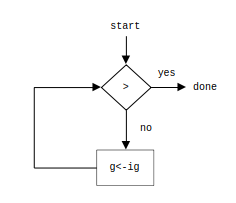

# Exercise 5.3

## Simplified `sqrt-iter`

*Data path diagram for simplified `sqrt-iter`*

*Controller diagram for simplified `sqrt-iter`*

## Expanded `sqrt-iter`

*Data path diagram for expanded `sqrt-iter`*

*Controller diagram for expanded `sqrt-iter`*