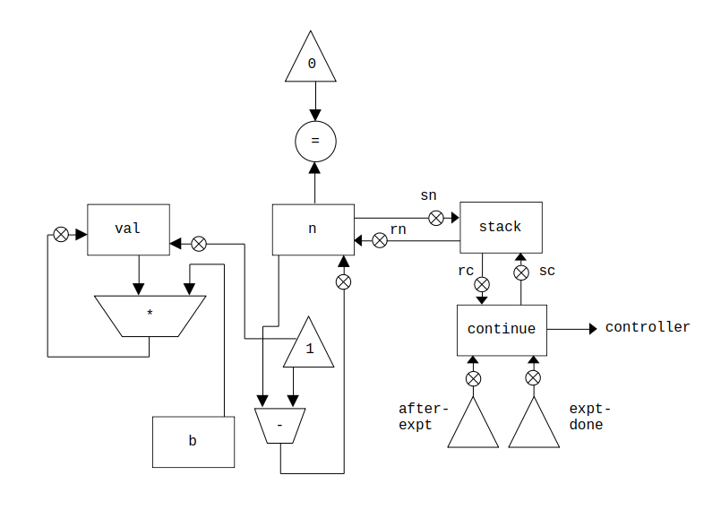
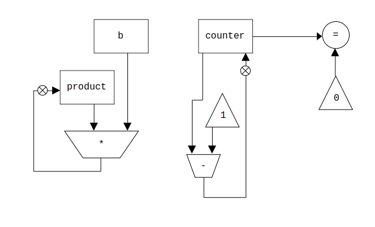

# Exercise 5.4

## Part A - Recursive Exponentiation

### Procedure

``` Scheme
(define (expt b n)
  (if (= n 0)
      1
      (* b (expt b (- n 1)))))
```

### Controller Instruction Sequence

```
(controller
    (assign continue (label expt-done))
  expt-loop
    (test (op =) (reg n) (const 0))
    (branch (label base-case))
    (save continue)
    (save n)
    (assign n (op -) (reg n) (const 1))
    (assign continue (label after-expt))
    (goto (label expt-loop))
  after-expt
    (restore n)
    (restore continue)
    (assign val (op *) (reg b) (reg val))
    (goto (reg continue))
  base-case
    (assign val (const 1))
    (goto (reg continue))
  expt-done)
```

### Data Path Diagram



*Data path diagram for recursive exponentiation*

## Part B - Iterative Exponentiation

### Procedure

``` Scheme
(define (expt b n)
  (define (expt-iter counter product)
    (if (= counter 0)
        product
        (expt-iter (- counter 1) (* b product))))
  (expt-iter n 1))
```

### Controller Instruction Sequence

```
(controller
  test-counter
    (test (op =) (reg counter) (const 0))
    (branch (label iter-done))
    (assign product (op *) (reg b) (reg product))
    (assign counter (op -) (reg counter) (const 1))
    (goto (label test-counter))
  iter-done)
```

### Data Path Diagram



*Data path diagram for iterative exponentiation*